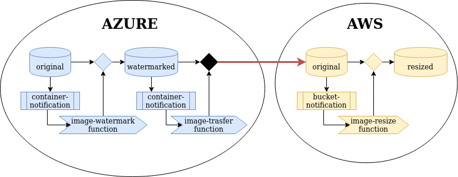

# xOpera deploy that connects Azure and AWS
This is a simple xOpera deploy that connects Azure and AWS via Azure function.

## Table of Contents
  - [Purpose](#purpose)
  - [Functionality](#functionality)
  - [Quick test and deploy](#quick-test-and-deploy)
  - [Deployment instructions](#deployment-instructions)
      - [Prerequisites](#prerequisites)
      - [Roles and deployment](#roles-and-deployment)
          - [Azure roles](#azure-roles)
          - [AWS roles](#aws-roles)
          - [Data transfer roles](#data-transfer-roles)
      - [Setting inputs](#setting-inputs)
          - [Azure inputs](#azure-inputs)
          - [AWS inputs](#aws-inputs)
          - [Data transfer inputs](#data-transfer-inputs)
      - [Running with xOpera](#running-with-xopera)

## Purpose
This repository implements Azure-AWS connection and data flow from Azure to AWS.

## Functionality
The main functionality of this solution is to sequentially execute two operations on images which are image-watermark and image-resize
on two different platforms (Azure and AWS). Orchestration creates 2 containers on Azure (original and watermarked) and 2 buckets
on AWS (original and resized). When user uploads jpg image to original container on Azure watermarked image will be created in
watermarked container using the watermarking function  that lives in Azure environment. When image is passed on to watermarking container
that event will trigger transferring function from Azure portal that will transfer watermarked image to original bucket on AWS S3.
Upload to AWS original bucket triggers image-resize lambda function on AWS that creates thumbnails of watermarked image in resized bucket.

The whole process is shown on image below.



## Quick test and deploy
If you want to test this solution immediately run the following commands:

```console
# Install AWS CLI v2
curl "https://d1vvhvl2y92vvt.cloudfront.net/awscli-exe-linux-x86_64.zip" -o "awscliv2.zip"
unzip awscliv2.zip
sudo ./aws/install

# Configure your account with your aws credentials (access key, secret key, region)
aws configure

# configure AWS credentials (used for data transfer)
echo '{ "access_key_id": "MYACCESSKEY", "secret_access_key": "MYSECRETKEY" }' > /tmp/aws_credentials.json

# install Azure CLI and try to login in your account
curl -sL https://aka.ms/InstallAzureCLIDeb | sudo bash
az login

# setup azure function tools
wget -q https://packages.microsoft.com/config/ubuntu/19.04/packages-microsoft-prod.deb
sudo dpkg -i packages-microsoft-prod.deb
sudo apt-get update
sudo apt-get install azure-functions-core-tools
rm packages-microsoft-prod.deb

# Initialize virtualenv with Python 3.6 and install prerequisites
python3.6 -m venv .venv
source .venv/bin/activate
pip install --upgrade pip
pip install ansible
pip install opera

# run xOpera service (make sure to setup the env vars in yaml file, there is an example in inputs-example.yaml file)
opera deploy -i inputs.yaml service.yaml
```

Python 3.6 is required! If you don't have it follow this answer: https://stackoverflow.com/questions/55773634/how-to-install-python-3-6-on-ubuntu-19-04

## Deployment instructions
The next part explains the deployment of this solution in detail.

### Prerequisites
This topic explains prerequisites to run xOpera deploy. If you want to test it immediately go to [quick test](#quick-test-and-deploy)

To be able to run these roles you should use virtual environment with Python 3.6 (there are some issues with Python 3.7)
and install the latest Ansible version.

```console
python3.6 -m venv .venv
source .venv/bin/activate
pip install --upgrade pip
pip install ansible
```

Next, you can install opera orchestrator to your virtual environment from [here](https://github.com/xlab-si/xopera-opera).
Basically you need to install it using `pip install opera`.

You should also install and sign in with [Azure CLI](https://docs.microsoft.com/en-us/cli/azure/authenticate-azure-cli?view=azure-cli-latest)
using `az login` command. This is important because user gets authenticated via cli right now.

The next thing is to set up the Azure function tools using the commands below:

```console
wget -q https://packages.microsoft.com/config/ubuntu/19.04/packages-microsoft-prod.deb
sudo dpkg -i packages-microsoft-prod.deb
sudo apt-get update
sudo apt-get install azure-functions-core-tools
rm packages-microsoft-prod.deb
```

The requirement is also [AWS CLI](https://docs.aws.amazon.com/cli/latest/userguide/cli-chap-install.html) which must be installed and configured. You can run:

```console
# Install AWS CLI v2
curl "https://d1vvhvl2y92vvt.cloudfront.net/awscli-exe-linux-x86_64.zip" -o "awscliv2.zip"
unzip awscliv2.zip
sudo ./aws/install

# Configure your account with your aws credentials (access key, secret key, region)
aws configure
```

### Roles and deployment
There are 9 playbooks separated into 3 folders - azure, aws and transfer. Usage is explained in the table below:

#### Azure roles

| Role | Purpose
|:-------------|:-------------|
| **container-create** | Creates storage account and necessary container on specified Azure storage account |
| **function-deploy** | Creates FunctionApp and deploys a new function to Azure portal using Azure CLI |
| **container-notification** | Creates an event subscription trigger for function |

#### AWS roles

| Role | Purpose
|:-------------|:-------------|
| **aws_role** | Creates a new AWS role |
| **bucket** | Creates a new AWS S3 bucket |
| **lambda** | Prepares a zipfile with function and deploys it to AWS Lambda |
| **bucket-notification** | Creates bucket notification for triggering the lambda |

#### Data transfer roles

| Role | Purpose
|:-------------|:-------------|
| **function-deploy** | Creates FunctionApp and deploys transfer function to Azure portal using Azure CLI |
| **container-notification** | Creates an event subscription trigger for transfer function |

### Setting inputs
You can modify values of variables stored in `inputs.yaml` to set the suitable parameters like IPs, auth params, container names, paths etc. 
The file with inputs is later passed to xOpera at the beginning of the orchestration. There is also and example for inputs
in `inputs-example.yaml` that you can pass directly to xOpera.

#### Azure inputs

| Input | Purpose | Example
|:-------------|:-------------|:-------------|
| `host_ip` | IP address of your target machine for execution | localhost |
| `location` | Location for the created resources | westeurope |
| `resource_group_name` | Name of the resource group | Resource-Group |
| `storage_account_name` | The name of the new storage account | mystorageaccount |
| `container_in_name` | The name of the incoming Azure blob storage container | original |
| `container_out_name` | The name of the container with results | watermarked |
| `function_app_name` | Name of the new Function App | image-watermark-function-app |
| `function_name` | Name of the new Azure function - should be the same as folder name of the function | image-watermark-function |
| `event_subscription_name` | Name of event subscription trigger that will be created | watermark-function-trigger |

#### AWS inputs

| Input | Purpose | Example |
|:-------------|:-------------|:-------------|
| `host_ip` | IP address of your target machine for execution | localhost |
| `aws_region` | Your AWS region for your resources | eu-central-1 |
| `role_name` | The name of the new AWS role | RadonLambdaRole |
| `role_description` | AWS role description | Lambda role |
| `lambda_name` | The name of the new AWS Lambda function | image-resize-function |
| `function_alias` | New alias for the function | latest |
| `permission_id` | Id of the permission | lambda_test_permission |
| `bucket_in_name` | Name of the incoming bucket for original images | original |
| `bucket_out_name` | The name of the bucket containing resized images | resized |
| `lambda_runtime` | Runtime of the deployed lambda | python3.6 |
| `lambda_handler` | Function and method with lambda handler | Python example: image_resize.lambda_handler, Java example:package.ClassName::handlerFunction |
| `lambda_timeout` | Function timeout in seconds | 5 |
| `lambda_memory` | Function memory in MB | 128 |

#### Data transfer inputs

| Input | Purpose | Example
|:-------------|:-------------|:-------------|
| `location` | Location for the created resources | westeurope |
| `resource_group_name` | Name of the resource group | Resource-Group |
| `storage_account_name` | The name of the new storage account | mystorageaccount |
| `aws_bucket_name` | The name of the incoming AWS S3 bucket - transfer destination | original |
| `azure_container_name` | The name of the Azure container - transfer source | watermarked |
| `transfer_function_app_name` | Name of the new Function App | image-transfer-function-app |
| `transfer_function_name` | Name of the new Azure function - should be the same as folder name of the function | image-transfer-function |
| `transfer_event_subscription_name` | Name of event subscription trigger that will be created | transfer-function-trigger |
| `aws_credentials` | Lookup to file aws_credentials.json in /tmp folder | "{{ lookup('file', '/tmp/aws_credentials.json') }}" |

## Running with xOpera
You can run xOpera resize service with `opera deploy -i inputs.yaml service.yaml`
